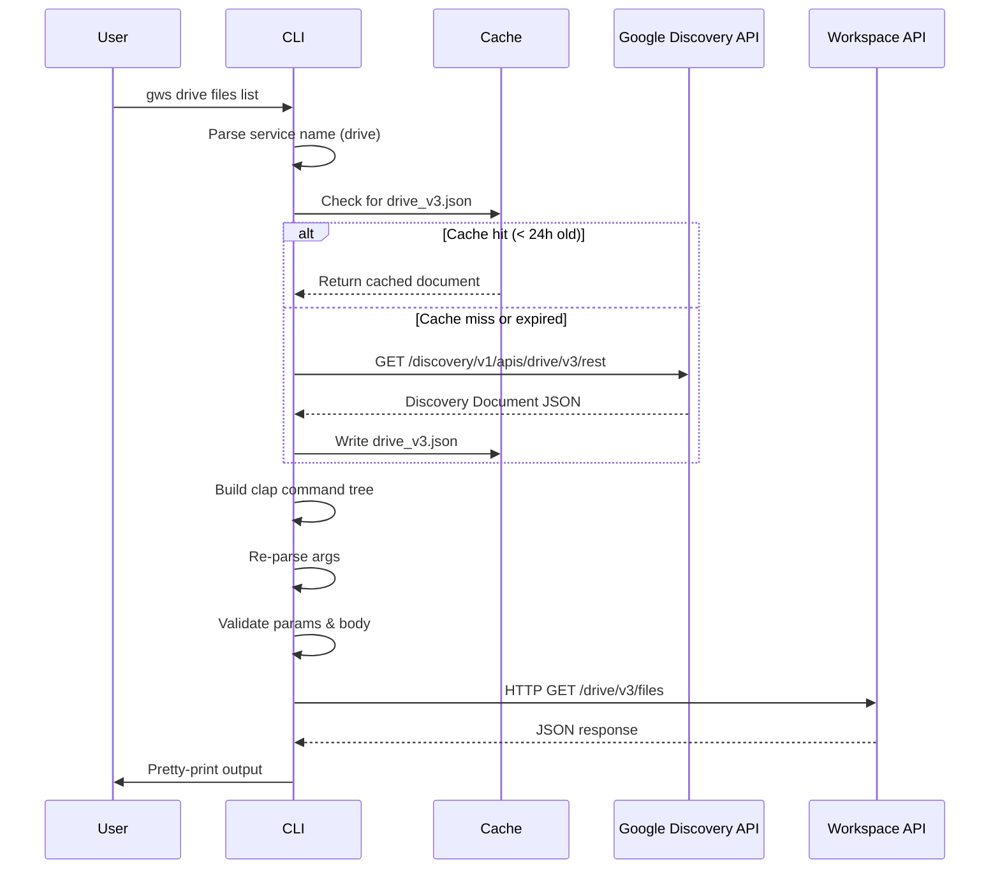

## Overview

`gws` doesn't ship a static list of commands. Instead, it reads Google's own [Discovery Service](https://developers.google.com/discovery) at runtime and builds its entire command surface dynamically. When Google Workspace adds an API endpoint or method, `gws` picks it up automatically — no code changes or releases required.

<Note>
  This approach means **zero static command definitions** exist in the codebase. Every command you see in `--help` is generated from a Discovery Document fetched at runtime.
</Note>

## Two-Phase Parsing Strategy

The CLI uses a **two-phase argument parsing** strategy to support dynamic command generation while maintaining a responsive user experience:

### Phase 1: Service Identification

1. Parse `argv[1]` to identify the service (e.g., `drive`, `gmail`, `sheets`)
2. Resolve the service alias to its Discovery API name and version
3. Fetch the service's Discovery Document from Google's API

```rust
// From src/main.rs:114-128
let (api_name, version) = parse_service_and_version(&args, first_arg)?;

let doc = if api_name == "workflow" {
    discovery::RestDescription {
        name: "workflow".to_string(),
        description: Some("Cross-service productivity workflows".to_string()),
        ..Default::default()
    }
} else {
    // Fetch the Discovery Document
    discovery::fetch_discovery_document(&api_name, &version)
        .await
        .map_err(|e| GwsError::Discovery(format!("{e:#}")))?
};
```

### Phase 2: Command Tree Construction

4. Build a dynamic `clap::Command` tree from the document's resources and methods
5. Re-parse the remaining arguments against this generated command tree
6. Authenticate, build the HTTP request, execute

```rust
// From src/main.rs:131-147
let cli = commands::build_cli(&doc);

let sub_args = filter_args_for_subcommand(&args);

let matches = cli.try_get_matches_from(&sub_args).map_err(|e| {
    if e.kind() == clap::error::ErrorKind::DisplayHelp
        || e.kind() == clap::error::ErrorKind::DisplayVersion
    {
        print!("{e}");
        std::process::exit(0);
    }
    GwsError::Validation(e.to_string())
})?;
```

## Discovery Document Structure

Google API Discovery Documents are JSON schemas that define:

- **Resources**: Logical groupings of API methods (e.g., `files`, `permissions`)
- **Methods**: Individual API operations with their HTTP method, path, parameters, and schemas
- **Schemas**: JSON Schema definitions for request/response bodies
- **Authentication**: Required OAuth scopes

### Example: Drive Files Resource

```json
{
  "name": "drive",
  "version": "v3",
  "rootUrl": "https://www.googleapis.com/",
  "servicePath": "drive/v3/",
  "resources": {
    "files": {
      "methods": {
        "list": {
          "httpMethod": "GET",
          "path": "files",
          "parameters": {
            "pageSize": {
              "type": "integer",
              "location": "query"
            }
          },
          "response": { "$ref": "FileList" }
        }
      }
    }
  }
}
```

This generates the CLI command:

```bash
gws drive files list --params '{"pageSize": 10}'
```

## Fetching and Caching

Discovery Documents are fetched over HTTPS and cached locally with a **24-hour TTL** to minimize network latency:

```rust
// From src/discovery.rs:186-240
pub async fn fetch_discovery_document(
    service: &str,
    version: &str,
) -> anyhow::Result<RestDescription> {
    let cache_dir = dirs::config_dir()
        .unwrap_or_else(|| std::path::PathBuf::from("."))
        .join("gws")
        .join("cache");
    std::fs::create_dir_all(&cache_dir)?;

    let cache_file = cache_dir.join(format!("{service}_{version}.json"));

    // Check cache (24hr TTL)
    if cache_file.exists() {
        if let Ok(metadata) = std::fs::metadata(&cache_file) {
            if let Ok(modified) = metadata.modified() {
                if modified.elapsed().unwrap_or_default() < std::time::Duration::from_secs(86400) {
                    let data = std::fs::read_to_string(&cache_file)?;
                    let doc: RestDescription = serde_json::from_str(&data)?;
                    return Ok(doc);
                }
            }
        }
    }

    let url = format!("https://www.googleapis.com/discovery/v1/apis/{service}/{version}/rest");

    let client = crate::client::build_client()?;
    let resp = client.get(&url).send().await?;

    let body = if resp.status().is_success() {
        resp.text().await?
    } else {
        // Try the $discovery/rest URL pattern used by newer APIs (Forms, Keep, Meet, etc.)
        let alt_url = format!("https://{service}.googleapis.com/$discovery/rest?version={version}");
        let alt_resp = client.get(&alt_url).send().await?;
        if !alt_resp.status().is_success() {
            anyhow::bail!(
                "Failed to fetch Discovery Document for {service}/{version}: HTTP {} (tried both standard and $discovery URLs)",
                alt_resp.status()
            );
        }
        alt_resp.text().await?
    };

    // Write to cache
    if let Err(e) = std::fs::write(&cache_file, &body) {
        let _ = e; // Non-fatal
    }

    let doc: RestDescription = serde_json::from_str(&body)?;
    Ok(doc)
}
```

### Cache Location

Discovery Documents are cached at:

- **Linux/macOS**: `~/.config/gws/cache/`
- **Windows**: `%APPDATA%\gws\cache\`

Each file is named `<service>_<version>.json` (e.g., `drive_v3.json`).

### URL Fallback Strategy

Newer Google APIs (Forms, Keep, Meet) use a different Discovery URL pattern. The fetcher tries both:

1. Standard: `https://www.googleapis.com/discovery/v1/apis/{service}/{version}/rest`
2. Alternate: `https://{service}.googleapis.com/$discovery/rest?version={version}`

## Service Registry

The CLI maintains a curated list of known services with human-friendly aliases in `src/services.rs`:

```rust
// From src/services.rs:26-177
pub const SERVICES: &[ServiceEntry] = &[
    ServiceEntry {
        aliases: &["drive"],
        api_name: "drive",
        version: "v3",
        description: "Manage files, folders, and shared drives",
    },
    ServiceEntry {
        aliases: &["gmail"],
        api_name: "gmail",
        version: "v1",
        description: "Send, read, and manage email",
    },
    ServiceEntry {
        aliases: &["sheets"],
        api_name: "sheets",
        version: "v4",
        description: "Read and write spreadsheets",
    },
    // ... 20+ more services
];
```

<Tip>
  You can use **any** Google API by specifying `<api>:<version>` syntax:
  
  ```bash
  gws pubsub:v1 projects topics list --params '{"project": "projects/my-project"}'
  ```
</Tip>

## Why This Approach?

### Advantages

1. **Zero Maintenance for New Endpoints**: Google adds new methods, parameters, or APIs → `gws` picks them up automatically after cache expires
2. **Always Up-to-Date**: The CLI is never out of sync with the actual API
3. **Consistency**: All services use the same command structure, validation, and error handling
4. **Smaller Binary**: No code generation bloat from 25+ API client libraries

### Trade-offs

1. **Network Dependency**: First run per service requires internet (but only once per 24h)
2. **Startup Latency**: ~100-300ms to fetch and parse Discovery Document on cold cache
3. **No Static Type Safety**: Parameters are validated at runtime against JSON schema, not at compile time

## Schema Introspection

You can inspect any method's schema without executing it:

```bash
# View request/response schemas for a method
gws schema drive.files.list

# Resolve all $ref pointers for deep inspection
gws schema drive.files.create --resolve-refs
```

Output includes:

- HTTP method and path template
- Required and optional parameters
- Request body schema (if applicable)
- Response schema
- OAuth scopes required

## Architecture Diagram



## Related Concepts

<CardGroup cols={2}>
  <Card title="Authentication" icon="key" href="/concepts/authentication">
    How credentials are loaded and tokens are obtained
  </Card>
  <Card title="Output Format" icon="table" href="/concepts/output-format">
    Structured JSON output for all responses
  </Card>
</CardGroup>
